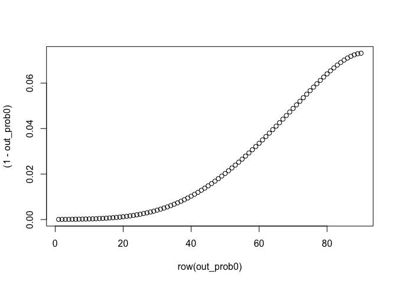

NFXP
================
Tomoya Ozawa
2021/07/08

## Data Generation Process

### Set True Parameters

``` r
p_x0 = 0.39
p_x1 = 0.59
p_x2 = 0.02

p <- c(p_x0, p_x1, p_x2)
```

``` r
RC <- 10.075
theta11 <- 2.293
beta <- 0.9999
```

## Estimation

### Functions

``` r
source("10_MonteCarlo_Simulation_NFP_function.r")
```

### Inner-loop

``` r
out_prob0 <- function_inner_loop(grid = 90, params_theta_1 = c(RC, theta11), method = "linear", beta = beta, params_theta_3 = p, threshold = 1e-6)
```

    ## Convergence NOT achieved in  0.1178774

``` r
# replication of Figure3
plot(row(out_prob0), (1- out_prob0))
```

<!-- -->
